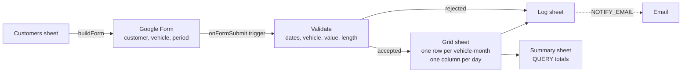

# Period Logger for Google Sheets

A Google Form that fills in a calendar grid in Google Sheets the way a careful person would by hand: it finds the right row, writes one value per day, refuses to overwrite what is already there, and leaves a note explaining what it did.

Built in Google Apps Script with no add-ons or libraries. The logic is tested offline with Node, so every rule below is checked before it ever touches a live spreadsheet.

<!-- Add screenshots to docs/ and they will show here.


-->

## What it does

- **Branching form, built from a sheet.** The `Customers` sheet lists customers and their vehicles. One click builds a Google Form where choosing a customer jumps to a page with only that customer's vehicles, then on to the shared date-range page. Add a customer, rebuild, same form link.
- **Calendar grid.** The `Grid` sheet has one row per customer, vehicle and month, with a column for each day of the month. A submitted period is written one cell per day, across month ends and financial-year ends, and rows are inserted in sorted position so the sheet stays readable.
- **Financial years.** Rows carry a financial-year label (for example `2026-27`). The start month is a setting: 1 for calendar years, 4 for April to March, 7 for July to June.
- **Nothing silently lost.** Days that already have a value are skipped and listed in the log, unless `OVERWRITE_EXISTING` is `TRUE`. Reversed dates are swapped. Bad dates, unknown vehicles, negative values and periods over the limit are rejected with a reason.
- **Every submission logged.** The `Log` sheet records timestamp, response ID, customer, vehicle, period, value, days written, days skipped, a status (`OK`, `PARTIAL`, `SKIPPED`, `DUPLICATE`, `ERROR`) and a plain-English message.
- **Safe under load.** A script lock serializes submissions, and a form response that fires twice is processed once.
- **Live totals.** `Summary` shows totals by customer and financial year, and by vehicle, using `QUERY` formulas that update as the grid changes. Each grid row carries its own `SUM`.
- **Optional email.** Set `NOTIFY_EMAIL` and every submission sends a one-paragraph summary.

## How it fits together



## Quick start (about ten minutes)

1. Create a blank Google Sheet.
2. Open **Extensions > Apps Script**. Delete the default `Code.gs` contents.
3. Create one script file for each file in `src/` (`Code`, `Grid`, `Submit`, `FormBuilder`) and paste the contents in. For the manifest, enable **Project Settings > Show "appsscript.json"** and paste `src/appsscript.json` over it.
4. In the editor, choose `runFullDemoSetup` and press **Run**. Approve the permissions when asked (Sheets, Forms, Drive, triggers and sending email, which the optional alert uses).
5. Go back to the spreadsheet. You now have `Config`, `Customers`, `Grid`, `Log` and `Summary`, six demo submissions already in the grid, and a **Period Logger** menu.
6. Open the form link from `Config > FORM_URL`, submit a period, and watch `Grid` and `Log` update.

A `Form Responses 1` sheet also appears. Google adds it when a form is linked to a spreadsheet. The script does not use it, but it is a handy raw record.

Prefer the command line? `clasp clone` or `clasp push` the `src/` folder; the manifest is included.

## Settings

All settings live in the `Config` sheet.

| Key | Default | What it does |
|---|---|---|
| `FY_START_MONTH` | `4` | Month the financial year starts, 1 to 12. |
| `FORM_TITLE` | Vehicle period submission | Form title. Rebuild the form after changing it. |
| `FORM_ID` | set by `buildForm` | Leave blank to create a new form on the next build. |
| `FORM_URL` | set by `buildForm` | The link to share with submitters. |
| `OVERWRITE_EXISTING` | `FALSE` | `TRUE` lets a new submission replace values already in the grid. |
| `MAX_DAYS_PER_SUBMISSION` | `92` | Longer periods are rejected and logged. |
| `NOTIFY_EMAIL` | blank | One email per submission. Blank turns it off. |

## Day to day

- **Add or remove vehicles:** edit `Customers`, then **Period Logger > 3. Build or rebuild form**. Set `Active` to `FALSE` to hide a vehicle from the form without losing its history; late submissions against it are still accepted.
- **Fix a mistake:** edit the grid cell directly, or set `OVERWRITE_EXISTING` to `TRUE` and resubmit the period.
- **Start over:** **Period Logger > Reset demo data** clears `Grid` and `Log` and keeps customers and the form.

Log statuses:

| Status | Meaning |
|---|---|
| `OK` | Every day in the period was written. |
| `PARTIAL` | Some days already had a value and were skipped; the message lists them. |
| `SKIPPED` | Every day already had a value. Nothing changed. |
| `DUPLICATE` | This form response was processed earlier. Nothing changed. |
| `ERROR` | Rejected before writing. The message says why. |

## Design notes

- **One vehicle question per customer.** Google Forms cannot filter a dropdown by an earlier answer, so each customer gets its own page and its own `Vehicle (Customer)` question. Choice navigation sends the respondent to the right page, and the page breaks route everyone on to the shared period page. The trigger only sees the question that was answered.
- **Dates as whole days.** Periods are expanded with UTC day arithmetic on `{y, m, d}` values, so month ends, leap days and daylight-saving changes cannot shift a day.
- **Sorted inserts, not sorts.** Missing month rows are inserted at their sorted position (customer, vehicle, month) with an in-memory index that tracks the row shifts. The sheet stays ordered without a full sort on every submission, and each new row gets its `SUM` formula in R1C1 form so it survives later inserts.
- **Idempotent by design.** The response ID is checked against the `Log` before any write, so a trigger that fires twice cannot double-book days.
- **Same path for everything.** Real submissions, the demo data and the tests all go through `processSubmission()`.

## Tests

```
node test/run.js
```

`test/harness.js` loads the `.gs` files into a Node sandbox with small in-memory versions of `SpreadsheetApp`, `FormApp`, `ScriptApp`, `LockService`, `PropertiesService`, `Utilities`, `Session` and `MailApp`, using the same 1-based range semantics as the real services. No Google account, no network. The 29 tests cover sheet setup, config coercion, date and financial-year rules, form structure and navigation, grid writing across month and year ends, overlap handling in both modes, duplicate suppression, every rejection reason, row ordering, the trigger end to end, the demo setup and email notification.

## Adapting it

- Different entities: rename `Customer` and `Vehicle` in `FORM`, `CUSTOMER_HEADERS` and `GRID_HEADERS`. The branching and grid logic do not care what the two levels are called.
- Different grid: the column map lives in one object (`GRID`). Change it there and the formulas and tests follow.
- No financial years: set `FY_START_MONTH` to `1` and the FY column shows the calendar year.

## Limits

- 31 day columns per row. Days that do not exist in a month stay blank.
- One numeric value per vehicle per day.
- Google Forms date questions return `yyyy-MM-dd`; the form itself does not block reversed ranges, which is why the script swaps them.
- Apps Script form-submit triggers run as the person who installed them, and quotas apply to that account.

## License

MIT. See `LICENSE`.
